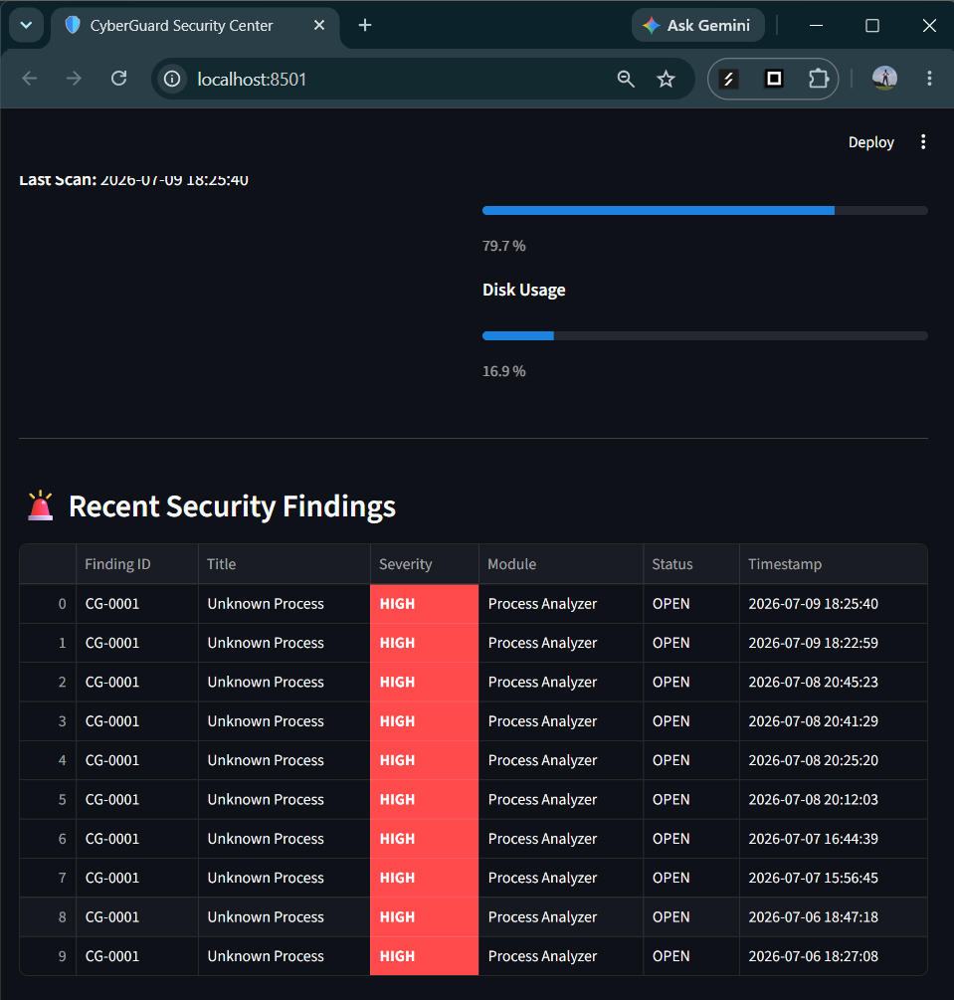
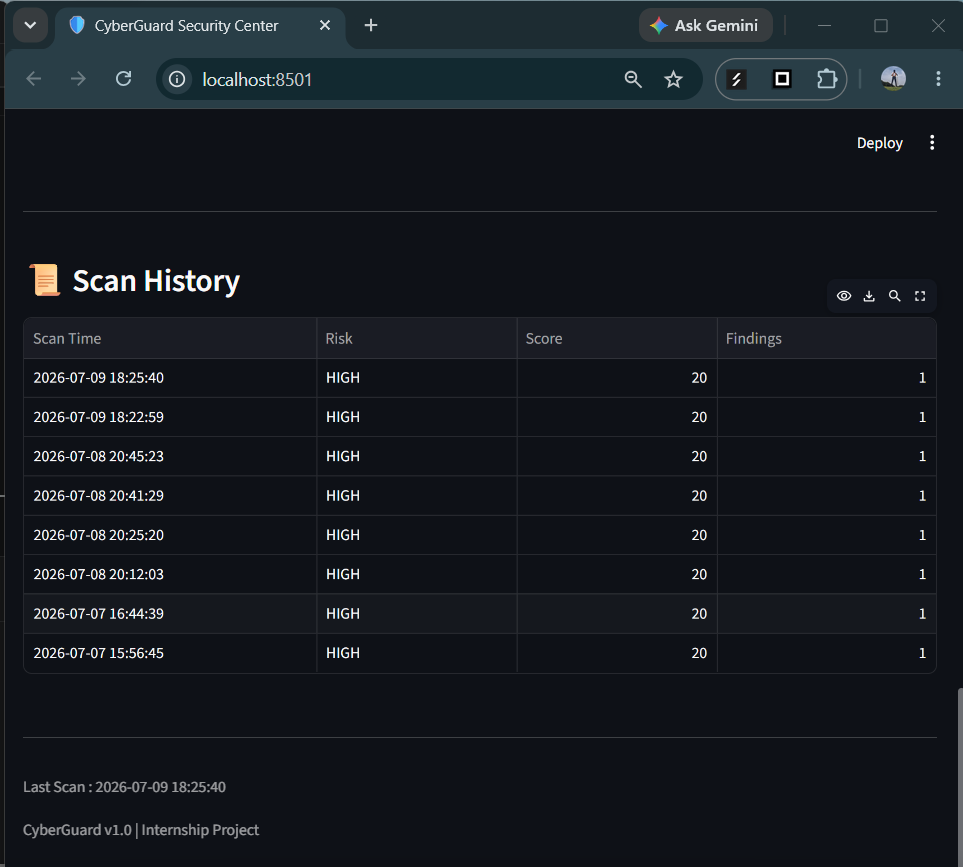
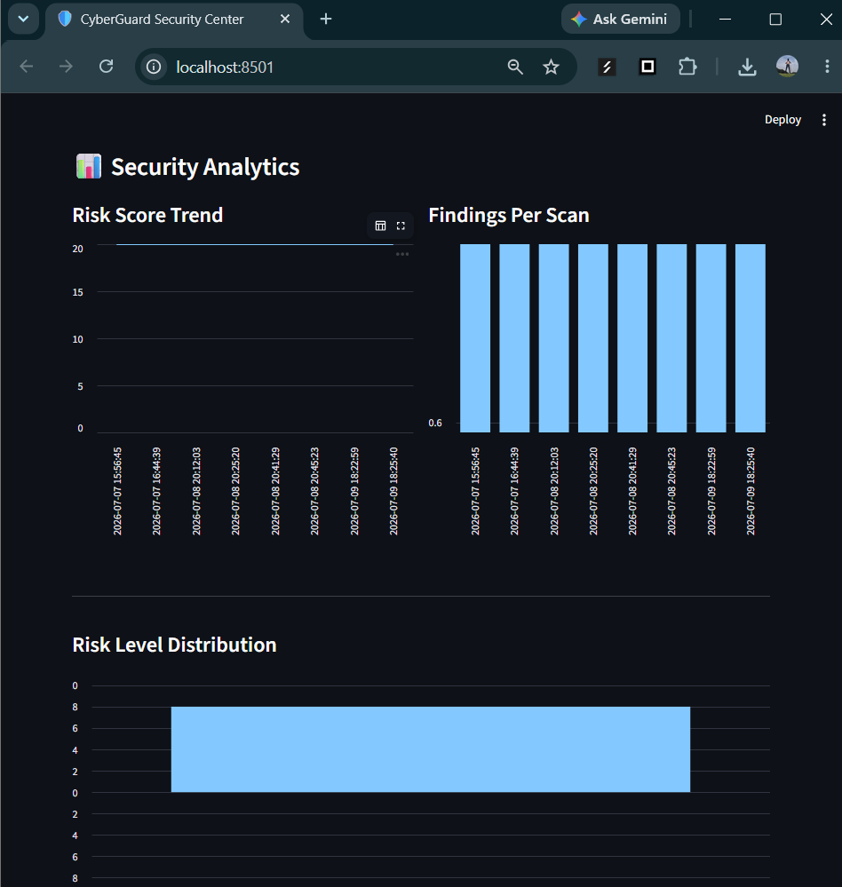
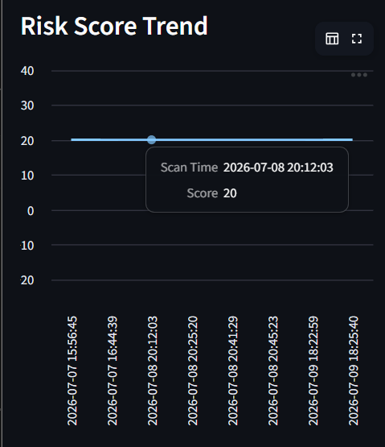
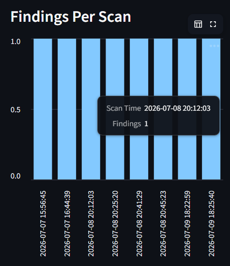
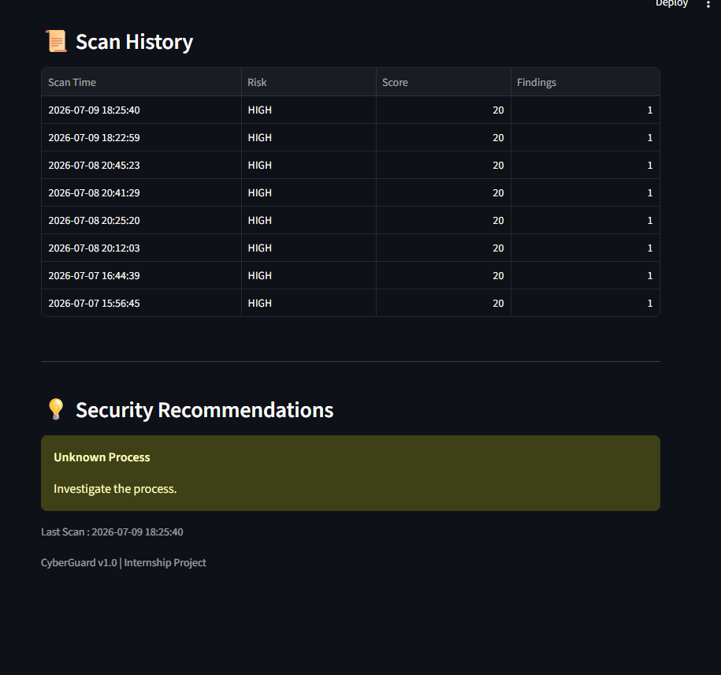

# 🛡 CyberGuard

## Automated Endpoint Security Assessment & Threat Monitoring System

CyberGuard is a Python-based Endpoint Security Assessment platform developed as an internship project. It performs automated endpoint inspection by collecting system information, auditing Windows security configurations, analyzing running processes, monitoring file integrity, calculating endpoint risk, storing historical assessments in SQLite, generating downloadable PDF reports, and providing an interactive Streamlit dashboard with analytics.

---

## Features

- Endpoint system information collection
- Windows security audit
- Running process analysis
- File integrity monitoring using SHA-256 hashing
- Automated risk scoring engine
- SQLite database for scan history
- Historical assessment tracking
- Interactive Streamlit dashboard
- Searchable security findings
- Severity filtering
- Module filtering
- Security analytics dashboard
- Risk score trend visualization
- Findings per scan analytics
- Risk level distribution
- Security recommendations panel
- Downloadable PDF security reports
- Command Line Interface (CLI)

---

# Project Workflow

```text
                    ┌────────────────────┐
                    │ Start Assessment   │
                    └─────────┬──────────┘
                              │
                              ▼
                Collect Endpoint Information
                              │
                              ▼
                  Windows Security Audit
                              │
                              ▼
                 Running Process Analysis
                              │
                              ▼
                 File Integrity Monitoring
                              │
                              ▼
                     Risk Assessment Engine
                              │
                              ▼
                 Store Results in SQLite
                              │
          ┌───────────────────┴───────────────────┐
          │                                       │
          ▼                                       ▼
 Generate PDF Report                 Update Dashboard
                                             │
      ┌──────────────────────────────────────┼──────────────────────────────────────┐
      ▼                                      ▼                                      ▼
Recent Findings                     Security Analytics                     Scan History
      │                                      │                                      │
      └──────────────────────────────┬───────┴──────────────────────────────────────┘
                                     ▼
                          Security Recommendations
```

---

# Project Structure

```text
CyberGuard/
│
├── analyzers/
├── collectors/
├── config/
├── core/
├── dashboard/
│   └── components/
├── database/
├── docs/
│   ├── screenshots/
│   ├── ARCHITECTURE.md
│   ├── DATABASE.md
│   ├── DEVELOPER_GUIDE.md
│   └── THREAT_MODEL.md
├── logs/
├── models/
├── reports/
├── test_files/
├── app.py
├── cli.py
├── README.md
└── requirements.txt
```

---

# Technologies Used

- Python
- Streamlit
- SQLite
- ReportLab
- psutil

---

# Installation

Clone the repository

```bash
git clone https://github.com/smruthinayak2006/CyberGuard.git

cd CyberGuard
```

---

Create a virtual environment

```bash
python -m venv venv
```

---

Activate the virtual environment

Windows

```bash
venv\Scripts\activate
```

---

Install dependencies

```bash
pip install -r requirements.txt
```

---

# Running CyberGuard

## Command Line Interface

```bash
python cli.py
```

---

## Launch Dashboard

```bash
streamlit run app.py
```

---

# Dashboard Preview

## Home Dashboard


---

## Running Security Assessment


---

## Dashboard After Scan


---

## Endpoint Information

CyberGuard displays endpoint details including:

- Hostname
- Operating System
- IP Address
- CPU Usage
- RAM Usage
- Disk Usage


---

## Windows Security Audit

CyberGuard inspects Windows security settings including:

- Firewall status
- Local users
- Installed Windows updates


---

## Running Process Analysis

CyberGuard analyzes currently running processes and identifies suspicious entries.


---

## Risk Assessment

Every scan produces an overall endpoint security assessment including:

- Risk Score
- Highest Severity
- Total Findings
- Security Recommendations


---

# PDF Security Reports

CyberGuard automatically generates a PDF report after every successful assessment.

Each report includes:

- Endpoint Information
- Windows Security Audit
- Risk Assessment
- Security Findings
- Scan Summary

## Generated Report


---

## Report Download

The latest PDF report can be downloaded directly from the dashboard.


---

# Security Findings

CyberGuard stores every detected security finding in SQLite and displays them inside the dashboard.

Each finding includes:

- Finding ID
- Title
- Severity
- Module
- Status
- Timestamp

Users can search and filter findings by severity and module.



---

# Scan History

Every assessment performed by CyberGuard is stored locally.

The dashboard provides historical visibility into previous assessments, including:

- Scan Time
- Risk Level
- Risk Score
- Number of Findings

This enables analysts to compare historical scans and monitor endpoint security over time.



---

# Security Analytics

CyberGuard provides visual analytics to simplify security assessment review.

The analytics dashboard includes:

- Risk Score Trend
- Findings Per Scan
- Risk Level Distribution

These charts are generated directly from historical assessment data stored in SQLite.

---

## Security Analytics Dashboard



---

## Risk Score Trend

Displays how the endpoint security score changes across assessments.



---

## Findings Per Scan

Displays the number of findings detected during each assessment.



---

# Security Recommendations

CyberGuard not only identifies security issues but also recommends possible remediation actions.

Recommendations are generated alongside each finding to help analysts understand the next steps.

Examples include:

- Investigate unknown processes
- Verify modified files
- Enable disabled security controls
- Review suspicious endpoint activity



---

# Documentation

Additional project documentation is available inside the **docs** directory.

- ARCHITECTURE.md
- DATABASE.md
- DEVELOPER_GUIDE.md
- THREAT_MODEL.md

These documents explain the internal architecture, database design, project setup, and threat model.

---

# Current Capabilities

CyberGuard currently provides:

- Endpoint inventory collection
- Windows security auditing
- Process analysis
- File integrity monitoring
- Automated risk scoring
- SQLite-based scan history
- Historical assessment tracking
- Interactive dashboard
- Searchable findings
- Severity filtering
- Module filtering
- Security analytics
- Security recommendations
- Automatic PDF report generation
- Report download
- Command Line Interface

---

# Project Highlights

- Modular Python architecture
- Offline operation
- Lightweight SQLite storage
- Interactive Streamlit interface
- Automatic report generation
- Historical assessment tracking
- Enterprise-style dashboard
- Easy to extend with additional security modules

---

# Future Improvements

The following enhancements are planned for future versions of CyberGuard.

## Endpoint Security

- Additional Windows security checks
- Windows Defender health monitoring
- Password policy auditing
- Startup program analysis
- Windows service auditing
- Scheduled automatic scans

---

## Reporting

- CSV report export
- JSON report export
- Executive summary reports
- Historical comparison reports

---

## Dashboard

- Endpoint Security Scorecard
- Advanced dashboard widgets
- Scan comparison view
- Finding drill-down
- Improved analytics
- Custom dashboard themes

---

## Platform Support

- Linux endpoint support
- Multi-endpoint management
- Remote endpoint scanning
- Centralized dashboard

---

## Notifications

- Email alerts
- Scheduled reports
- Critical finding notifications

---

# Why CyberGuard?

CyberGuard was developed to demonstrate the design and implementation of a lightweight endpoint security assessment platform using Python.

The project combines system information collection, Windows security auditing, process inspection, file integrity monitoring, risk assessment, historical scan storage, dashboard visualization, analytics, and PDF reporting into a modular application suitable for educational and internship purposes.

Unlike a simple command-line scanner, CyberGuard provides an interactive interface that allows users to review historical assessments, analyze trends, filter findings, and download professional security reports.

---

# Documentation

Additional technical documentation is available inside the `docs/` directory.

- ARCHITECTURE.md
- DATABASE.md
- DEVELOPER_GUIDE.md
- THREAT_MODEL.md

---

# Screenshots Included

The repository contains screenshots demonstrating the application's functionality.

| Screenshot | Description |
|------------|-------------|
| 01_dashboard_home.png | Home Dashboard |
| 02_start_assessment.png | Running Assessment |
| 03_dashboard_results.png | Dashboard After Scan |
| 04_endpoint_information.png | Endpoint Information |
| 05_windows_security_audit.png | Windows Security Audit |
| 06_process_analysis.png | Running Processes |
| 07_security_findings.png | Risk Assessment |
| 08_generated_pdf_report.png | Generated PDF Report |
| 09_dashboard_findings.png | Dashboard Findings |
| 10_report_download.png | Report Download |
| 11_recent_security_findings.png | Recent Security Findings |
| 12_scan_history.png | Scan History |
| 13_security_analytics.png | Security Analytics Dashboard |
| 14_risk_score_trend.png | Risk Score Trend |
| 15_findings_per_scan.png | Findings Per Scan |
| 16_security_recommendations.png | Security Recommendations |

---

# Requirements

```
Python 3.11+
Streamlit
SQLite
psutil
ReportLab
```

Install dependencies using:

```bash
pip install -r requirements.txt
```

---

# Author

**Smruthi Nayak**

B.Tech Computer Science Engineering

Cybersecurity & IoT Enthusiast

GitHub:
https://github.com/smruthinayak2006

LinkedIn:
https://www.linkedin.com/in/smruthi-nayak-51b31731a

---

## Project Status

**Version:** 1.0

**Status:** Version 1.0 (Ongoing Enhancements)

Current Modules:

- ✅ Endpoint Information Collection
- ✅ Windows Security Audit
- ✅ Process Analysis
- ✅ File Integrity Monitoring
- ✅ Risk Assessment Engine
- ✅ SQLite Scan History
- ✅ Interactive Dashboard
- ✅ Security Analytics
- ✅ Search & Filtering
- ✅ Security Recommendations
- ✅ PDF Report Generation
- ✅ Report Download
- 🚧 Endpoint Security Scorecard
- 🚧 Additional Windows Security Modules