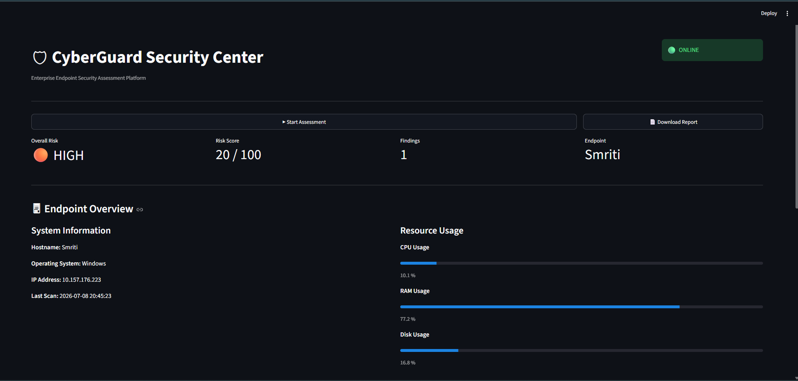
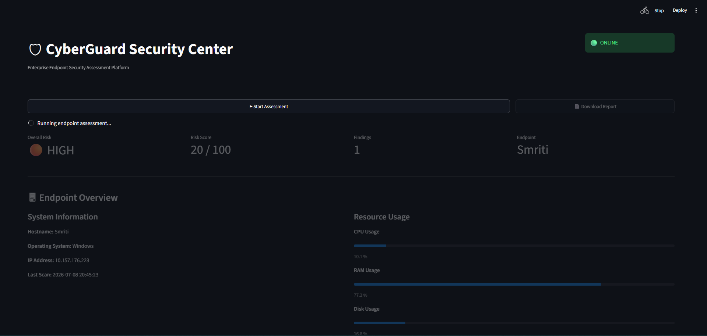
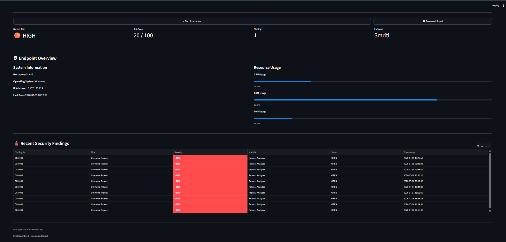
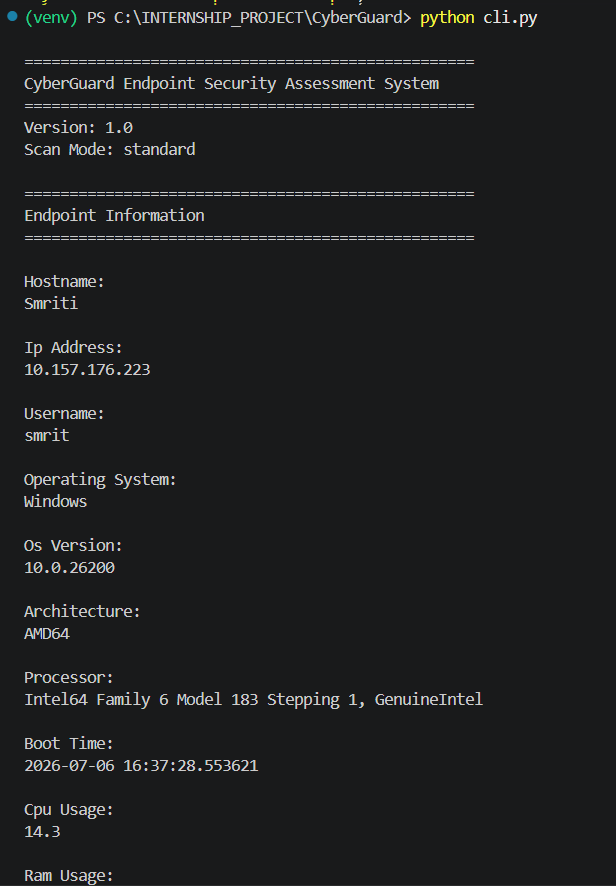
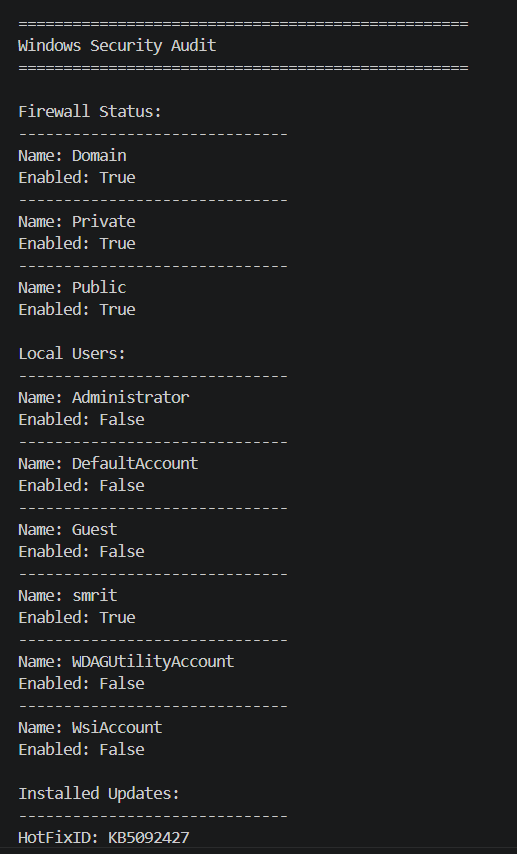
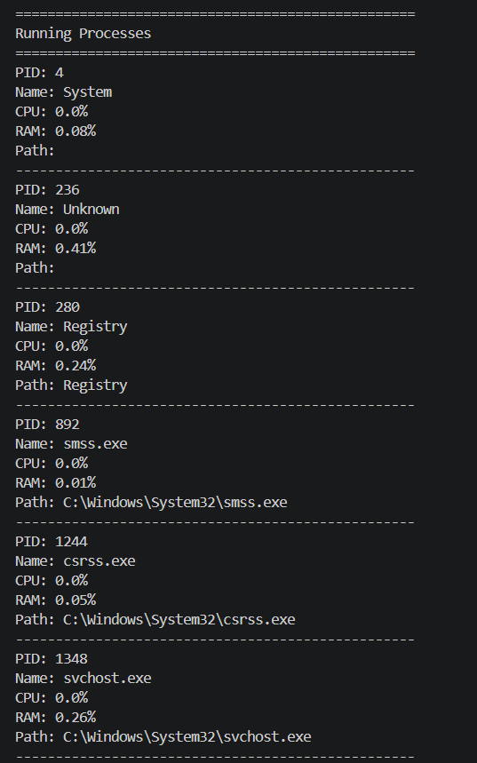
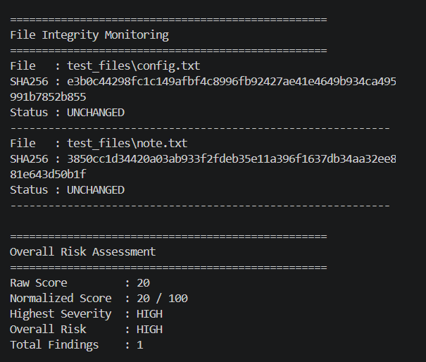
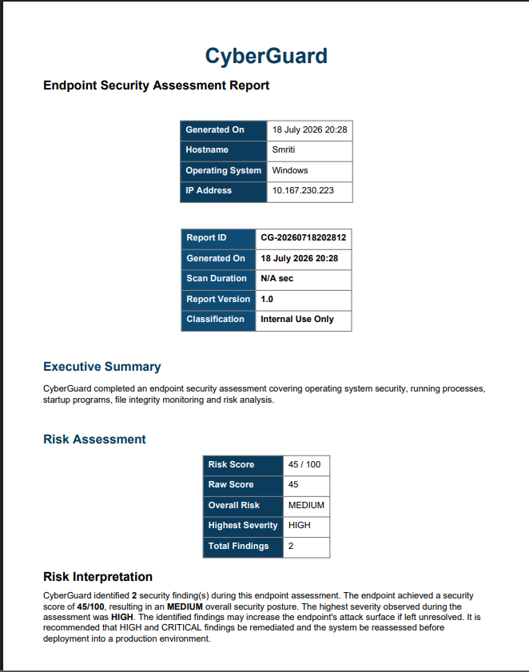
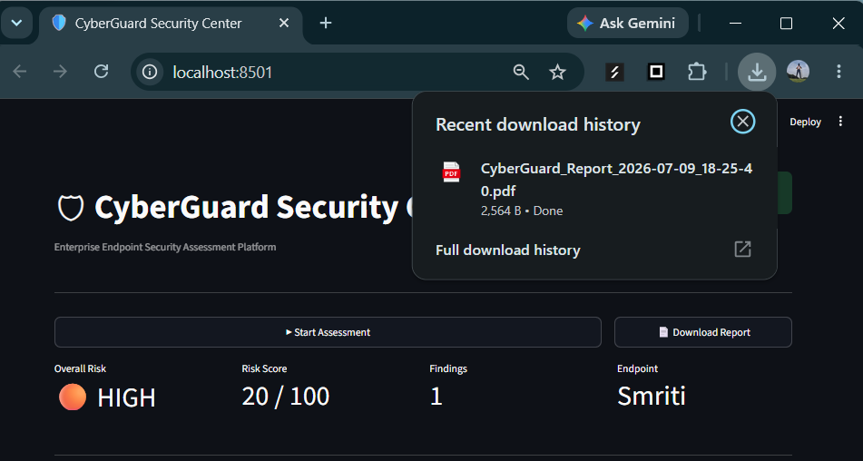
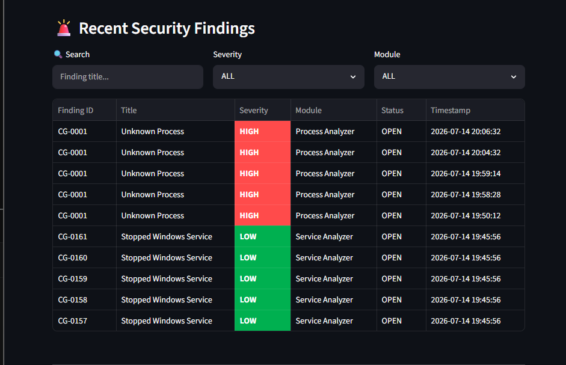

# 🛡️ CyberGuard

## Automated Endpoint Security Assessment & Threat Monitoring System

CyberGuard is a Python-based endpoint security assessment tool developed as an internship project. It collects endpoint information, performs basic Windows security checks, analyzes running processes, monitors file integrity, calculates an overall security risk score, stores scan history in SQLite, and generates a downloadable PDF security report through a simple Streamlit dashboard.

---

## Features

- Endpoint system information collection
- Windows security audit
- Running process analysis
- File integrity monitoring using SHA-256 hashing
- Security risk scoring engine
- SQLite database for scan history and findings
- Interactive Streamlit dashboard
- PDF security report generation
- Report download from dashboard
- Command-line interface (CLI)

---

## Project Workflow

```
Start Assessment
        │
        ▼
Collect Endpoint Information
        │
        ▼
Windows Security Audit
        │
        ▼
Running Process Analysis
        │
        ▼
File Integrity Monitoring
        │
        ▼
Risk Engine
        │
        ▼
Store Results in SQLite
        │
        ▼
Generate Security Report
        │
        ▼
Dashboard & PDF Download
```

---

## Project Structure

```
CyberGuard/

├── analyzers/
├── collectors/
├── config/
├── core/
├── dashboard/
├── database/
├── docs/
│   └── screenshots/
├── logs/
├── models/
├── reports/
├── scanners/
├── test_files/
├── app.py
├── cli.py
├── README.md
└── requirements.txt
```

---

## Technologies Used

- Python
- Streamlit
- SQLite
- ReportLab
- psutil

---

# Installation

Clone the repository

```bash
git clone https://github.com/smruthinayak2006/CyberGuard.git

cd CyberGuard
```

Create virtual environment

```bash
python -m venv venv
```

Activate environment

Windows

```bash
venv\Scripts\activate
```

Install dependencies

```bash
pip install -r requirements.txt
```

---

# Run from Command Line

```bash
python cli.py
```

---

# Launch Dashboard

```bash
streamlit run app.py
```

---

# Dashboard Preview

## Home Dashboard



---

## Running Assessment



---

## Dashboard After Scan



---

# CLI Scan

## Endpoint Information



---

## Windows Security Audit



---

## Running Process Analysis



---

## Risk Assessment



---

# PDF Security Report

Generated report



Downloaded report



---

# Scan History

The dashboard maintains previous scan findings and displays them in a table for review.



---

# Current Capabilities

- Collect endpoint information
- Monitor running processes
- Perform Windows security checks
- Detect monitored file changes
- Calculate overall risk score
- Store scan history
- Store security findings
- Generate PDF reports
- Download reports from dashboard

---

# Future Improvements

- Additional Windows security checks
- Linux endpoint support
- Scheduled assessments
- JSON and CSV report export
- Email notification support
- Improved threat detection rules

---

# Author

**Smruthi Nayak**

B.Tech Computer Science Engineering

Internship Project