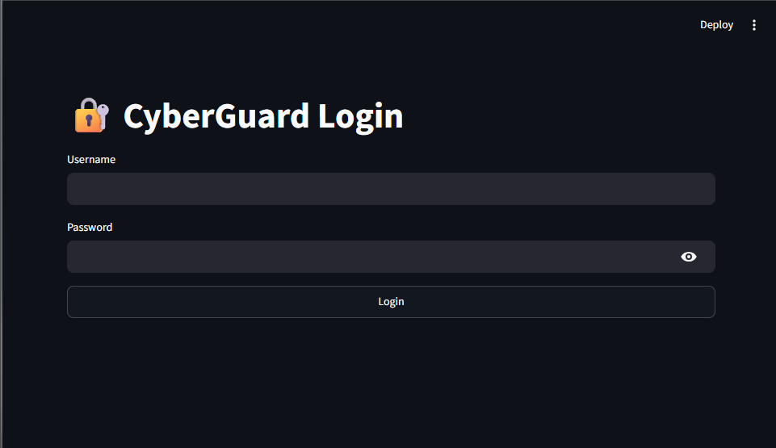
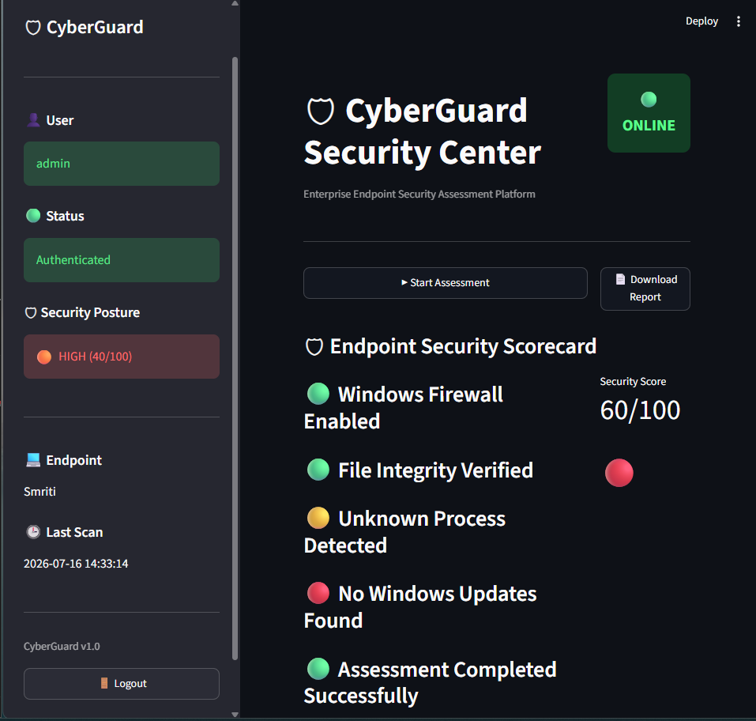
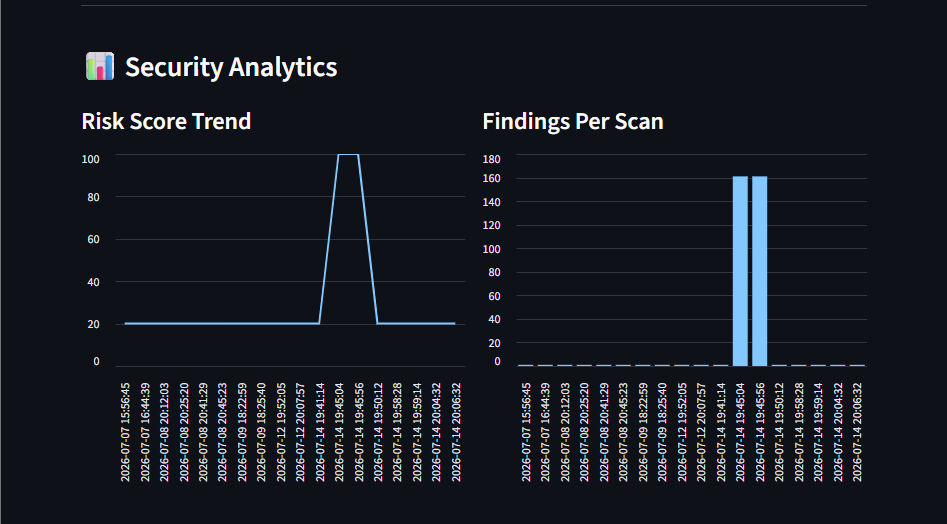
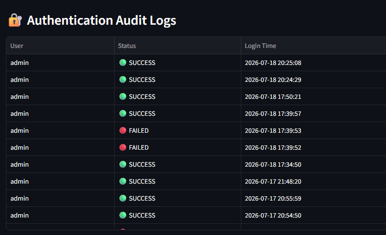

# 🛡 CyberGuard


## Automated Endpoint Security Assessment & Threat Monitoring System

CyberGuard is a Python-based endpoint security assessment platform developed as an internship project. It evaluates the security posture of Windows endpoints by auditing system security, analyzing running processes and startup programs, monitoring file integrity, calculating endpoint risk, and presenting results through an interactive Streamlit dashboard with downloadable PDF reports.

---

## ✨ Features

- Endpoint system information collection
- Windows security configuration auditing
- Running process analysis
- Startup program inspection
- SHA-256 file integrity monitoring
- Rule-based endpoint risk assessment
- Secure dashboard authentication with bcrypt
- Authentication audit logging
- SQLite-based assessment history
- Interactive security dashboard
- Professional PDF report generation

---

## 🔄 Assessment Workflow

```text
Start Assessment
       │
       ▼
Collect Endpoint Information
       │
       ▼
Windows Security Audit
       │
       ▼
Analyze Running Processes
       │
       ▼
Analyze Startup Programs
       │
       ▼
File Integrity Monitoring
       │
       ▼
Risk Assessment Engine
       │
       ▼
Store Assessment History
       │
       ├──────────────► Interactive Dashboard
       │
       └──────────────► PDF Security Report
```

---

# 📸 Dashboard Preview

### Login Authentication



### Security Dashboard



### Security Analytics



### Security Findings Explorer


### Authentication Audit Logs



### Generated PDF Report


---

# 🏗 Project Architecture

```
                CyberGuard

        CLI / Dashboard (Streamlit)
                   │
                   ▼
             Scan Orchestrator
                   │
      ┌────────────┼────────────┐
      │            │            │
      ▼            ▼            ▼
Collectors    Analyzers     Risk Engine
      │            │            │
      └────────────┼────────────┘
                   ▼
            SQLite Database
                   │
          ┌────────┴────────┐
          ▼                 ▼
 Dashboard Interface   PDF Reports
```

---

# 📁 Project Structure

```text
CyberGuard
│
├── analyzers/        Security analysis modules
├── collectors/       Endpoint information collection
├── config/           Project configuration
├── core/             Scan orchestration
├── dashboard/        Streamlit dashboard
├── database/         SQLite database & authentication
├── docs/             Documentation & screenshots
├── models/           Data models
├── reports/          PDF report generation
├── test_files/       File integrity test files
│
├── app.py            Dashboard entry point
├── cli.py            Command-line scanner
├── README.md
└── requirements.txt
```

---

# 🛠 Technology Stack

| Component | Technology |
|-----------|------------|
| Language | Python 3.13 |
| Dashboard | Streamlit |
| Database | SQLite |
| Authentication | bcrypt |
| Endpoint Monitoring | psutil |
| Report Generation | ReportLab |
| File Integrity | SHA-256 |
| Version Control | Git & GitHub |

---

# 🚀 Getting Started

## Clone Repository

```bash
git clone https://github.com/smruthinayak2006/CyberGuard.git
cd CyberGuard
```

## Create Virtual Environment

```bash
python -m venv venv
```

## Activate Environment

```bash
venv\Scripts\activate
```

## Install Dependencies

```bash
pip install -r requirements.txt
```

---

# ▶ Running CyberGuard

### Dashboard

```bash
streamlit run app.py
```

### Command-Line Scanner

```bash
python cli.py
```

---

# 📄 Documentation

Additional documentation is available in the **docs/** directory.

- Architecture Overview
- Database Design
- Developer Guide
- Threat Model

---

# 👩‍💻 Author

**Smruthi Nayak**

B.Tech Computer Science & Engineering

GitHub  
https://github.com/smruthinayak2006

LinkedIn  
https://www.linkedin.com/in/smruthi-nayak